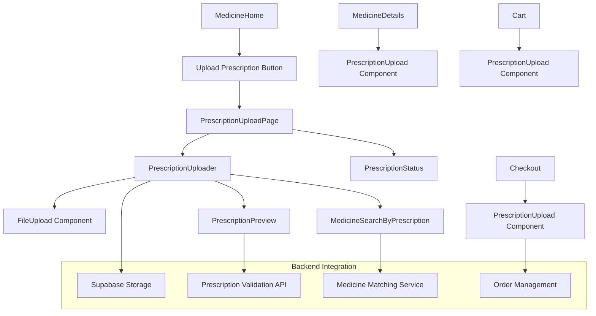
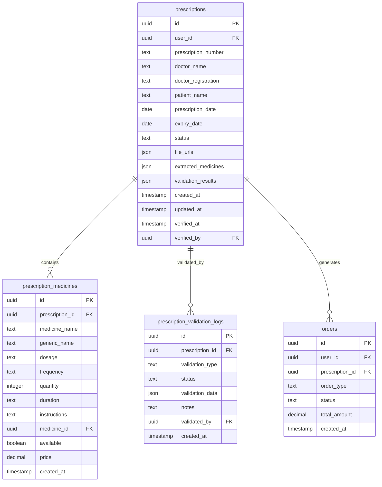
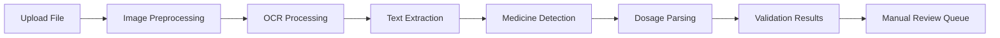
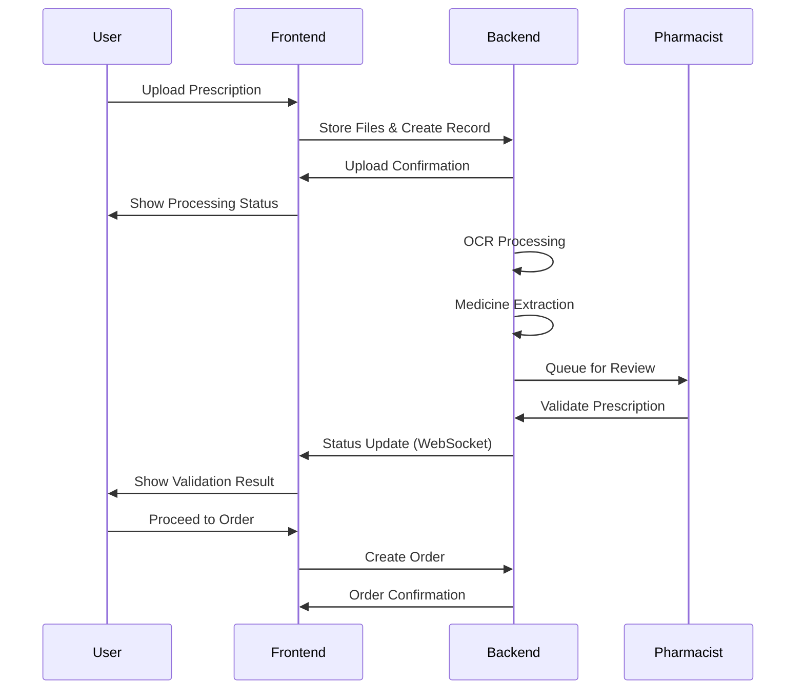
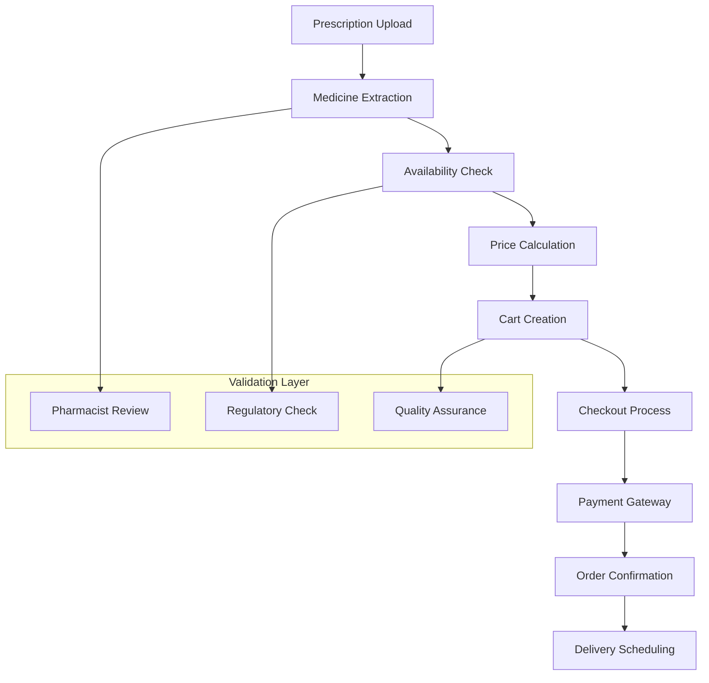

# Prescription Upload Feature Design for Healthcare E-commerce Platform

## Overview

This design addresses the identified issues in the prescription upload functionality within the medicine module and proposes a comprehensive solution for a healthcare e-commerce platform in India, complying with Indian regulations and providing seamless user experience.

## Identified Issues

### Current Problems
1. **Missing Route Implementation**: The MedicineHome component navigates to `/medicines/upload-prescription` route which doesn't exist
2. **Incomplete Component Integration**: PrescriptionUpload components exist but lack proper backend integration
3. **No File Storage Implementation**: File uploads are logged to console without actual storage
4. **Missing Database Schema**: No prescription-related tables in the current Supabase schema
5. **Incomplete Workflow**: Prescription upload doesn't integrate with order processing
6. **Missing Validation**: No prescription verification or validation workflow
7. **No Progress Tracking**: Users cannot track prescription approval status

## Architecture

### Component Structure

### Database Schema Extensions

## Feature Specifications

### 1. Prescription Upload Page

#### Upload Methods
- **Drag & Drop Interface**: Primary upload method with visual feedback
- **File Browser**: Traditional file selection with multi-file support
- **Camera Capture**: Mobile-optimized camera integration
- **WhatsApp Integration**: Share prescriptions via WhatsApp API
- **Email Upload**: Send prescriptions to dedicated email address

#### File Validation
- **Supported Formats**: JPG, PNG, PDF, HEIC
- **File Size Limits**: Maximum 5MB per file, 10 files per prescription
- **Image Quality Check**: Minimum resolution and readability validation
- **Duplicate Detection**: Prevent duplicate uploads

#### OCR and Text Extraction

### 2. Prescription Processing Workflow

#### Automated Processing
1. **File Upload**: Secure storage in Supabase Storage with encryption
2. **OCR Analysis**: Extract text using Google Vision API or Tesseract
3. **Medicine Identification**: Match extracted text with medicine database
4. **Dosage Parsing**: Extract quantity, frequency, and duration
5. **Availability Check**: Verify medicine availability and pricing
6. **Pharmacist Review**: Queue for manual verification if needed

#### Validation Stages
- **Format Validation**: Check file format and quality
- **Content Validation**: Verify prescription elements (doctor info, patient details)
- **Medicine Validation**: Confirm medicine names and dosages
- **Regulatory Compliance**: Ensure prescription meets Indian drug laws
- **Pharmacist Approval**: Final verification by licensed pharmacist

### 3. Prescription Status Management

#### Status Types
- `UPLOADED`: Initial upload completed
- `PROCESSING`: OCR and analysis in progress
- `REVIEW_REQUIRED`: Manual review needed
- `VALIDATED`: Pharmacist approved
- `REJECTED`: Invalid or problematic prescription
- `EXPIRED`: Prescription past validity period
- `FULFILLED`: Order completed successfully

#### Real-time Updates

### 4. Medicine Search by Prescription

#### Smart Matching Algorithm
- **Exact Match**: Direct medicine name matching
- **Generic Matching**: Map brand names to generic equivalents
- **Alternative Suggestions**: Suggest available alternatives
- **Price Optimization**: Show best price options
- **Availability Check**: Real-time stock verification

#### Search Results Display
- **Matched Medicines**: Exact matches with pricing
- **Alternative Options**: Generic and branded alternatives
- **Unavailable Items**: Medicines not in stock with alternatives
- **Price Breakdown**: Individual and total pricing
- **Substitution Warnings**: Pharmacist notes for substitutions

### 5. Regulatory Compliance (India)

#### Legal Requirements
- **Drug Controller General of India (DCGI)** compliance
- **Prescription format validation** as per Indian standards
- **Pharmacist verification** for Schedule H and H1 drugs
- **Patient identification** requirements
- **Record keeping** for regulatory audits

#### Security Measures
- **Data Encryption**: End-to-end encryption for prescription data
- **Access Control**: Role-based access to prescription information
- **Audit Trails**: Complete tracking of prescription handling
- **HIPAA-like Privacy**: Patient data protection measures
- **Secure Storage**: Encrypted file storage with access logs

### 6. Integration Points

#### Order Flow Integration

#### Cart Integration
- **Auto-populate Cart**: Add extracted medicines to cart automatically
- **Prescription Linking**: Link cart items to prescription ID
- **Quantity Validation**: Ensure ordered quantity matches prescription
- **Substitution Handling**: Manage alternative medicine selections

### 7. User Experience Enhancements

#### Mobile Optimization
- **Camera Integration**: Native camera capture with real-time preview
- **Touch-friendly Interface**: Large touch targets and intuitive gestures
- **Offline Capability**: Queue uploads when connectivity is poor
- **Progress Indicators**: Clear visual feedback on upload and processing status

#### Desktop Features
- **Bulk Upload**: Multiple prescription upload with batch processing
- **Advanced Preview**: Detailed file preview with zoom and annotation
- **Drag & Drop Zones**: Multiple drop zones for organized uploading
- **Keyboard Shortcuts**: Power user features for frequent users

### 8. Communication Features

#### WhatsApp Integration
- **Direct Sharing**: Share prescriptions via WhatsApp Business API
- **Status Notifications**: WhatsApp updates on prescription status
- **Customer Support**: WhatsApp chat for prescription queries

#### Email Integration
- **Email Upload**: Send prescriptions to dedicated email address
- **Automated Processing**: Parse email attachments for prescriptions
- **Confirmation Emails**: Status updates via email notifications

### 9. Analytics and Monitoring

#### User Analytics
- **Upload Success Rates**: Track upload completion rates
- **Processing Times**: Monitor average processing duration
- **Error Analysis**: Identify common failure points
- **User Satisfaction**: Track user experience metrics

#### Business Intelligence
- **Medicine Demand**: Track frequently prescribed medicines
- **Prescription Patterns**: Analyze prescription trends
- **Revenue Impact**: Monitor prescription-driven sales
- **Compliance Metrics**: Track regulatory compliance rates

### 10. Error Handling and Recovery

#### Common Error Scenarios
- **Poor Image Quality**: Guide users to retake photos
- **Unreadable Text**: Fallback to manual entry
- **Medicine Not Found**: Suggest alternatives or custom requests
- **Expired Prescriptions**: Clear messaging and renewal guidance

#### Recovery Mechanisms
- **Retry Logic**: Automatic retry for temporary failures
- **Manual Fallback**: Option to manually enter prescription details
- **Customer Support**: Direct escalation to pharmacist review
- **Alternative Paths**: Multiple upload methods as backup

### 11. Testing Strategy

#### Automated Testing
- **Unit Tests**: Component-level functionality testing
- **Integration Tests**: End-to-end prescription flow testing
- **Performance Tests**: Load testing for file uploads and processing
- **Security Tests**: Vulnerability and data protection testing

#### Manual Testing
- **Usability Testing**: User experience validation
- **Pharmacist Validation**: Professional review process testing
- **Regulatory Compliance**: Legal requirement verification
- **Device Testing**: Cross-platform and browser compatibility

## Implementation Phases

### Phase 1: Foundation (Week 1-2)
- Create prescription upload page and routing
- Implement basic file upload with Supabase Storage
- Add database schema for prescriptions
- Basic UI components and validation

### Phase 2: Core Features (Week 3-4)
- OCR integration and text extraction
- Medicine matching and availability checking
- Prescription status tracking
- Pharmacist review workflow

### Phase 3: Advanced Features (Week 5-6)
- WhatsApp and email integration
- Mobile camera optimization
- Advanced analytics and monitoring
- Enhanced error handling

### Phase 4: Compliance and Security (Week 7-8)
- Regulatory compliance implementation
- Security auditing and encryption
- Performance optimization
- Production deployment preparation

## Success Metrics

### Technical Metrics
- **Upload Success Rate**: >95% successful uploads
- **Processing Time**: <2 minutes average processing
- **Accuracy Rate**: >90% correct medicine extraction
- **System Uptime**: 99.9% availability

### Business Metrics
- **User Adoption**: 30% of medicine orders use prescription upload
- **Conversion Rate**: 80% of uploaded prescriptions convert to orders
- **Customer Satisfaction**: >4.5/5 rating for prescription service
- **Compliance Score**: 100% regulatory compliance rate